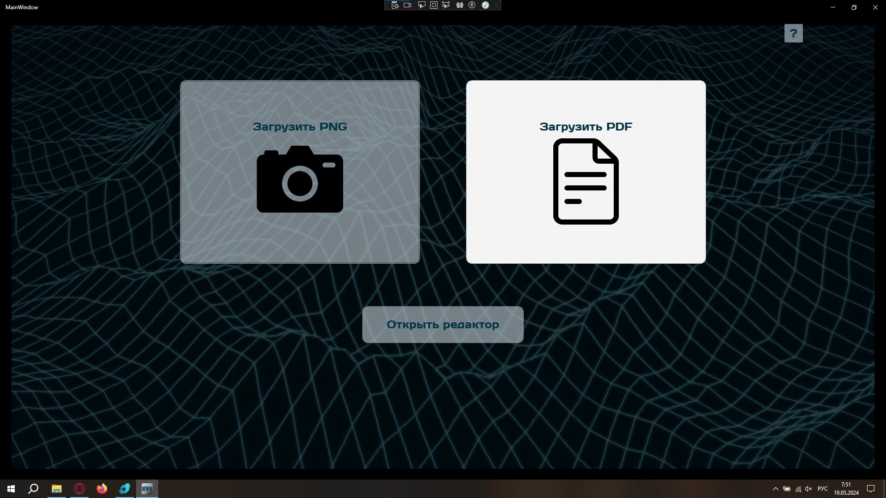
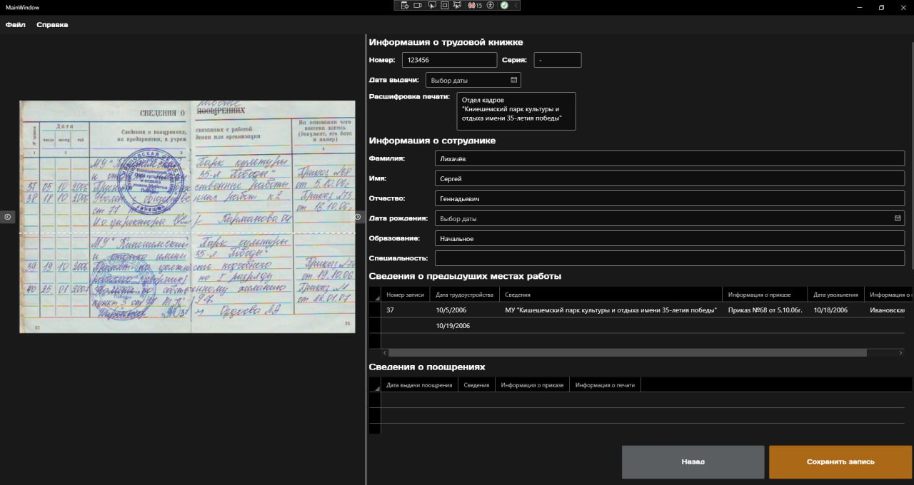

# Здравствуй, дорогой пользователь!
Это программа для упрощения оцифровки трудовых книжек.
## Приветсвие
На первой странице тебя приветствуют 4 кнопки: Загрузить png/pdf, ручное заполнение полей книжки, и справка (он же '?').
  Со справкой(?) вы уже разобрались, иначе вы бы никак сюда не попали.
Чтобы загрузить файл для сканирования, вы можете:
  - Либо нажать на них, и тогда появится окно выбора файлов, где вы можете выбрать любой файлик с вашего компьютера, который вам нужно отсканировать.
  - Либо можно просто перетащить необходимый вам файл в основное окно, и тогда ваш файлик автоматически загрузится в систему.

  Ручное заполнение полей книжки - вы можете сразу перейти на вторую страницу и вводить свои данные с нуля без предварительной цифровой обработки изображения.

## Страница редактора

Вторая страница разделена на две части:

  Левая представляет собой окно предпросмотра исходного скана страницы книжки. Там вы можете приближать и двигать картинку внутри окна (с помощью удержания левой кнопки  или прокрутки колесика мыши. Чтобы вернуть исходный размер и положение картинки, надо просто кликнуть правой кнопкой мыши)

  Правая - это редактор полей трудовой книги, куда выгружаются результаты сканирования и где вы можете самостоятельно проанализировать и внести правки в заполнение формы.

  Также на странице есть меню навигации: "Файл", "Справка", которые позволяют взаимодействовать с файлами на компьютере.

Справа снизу же есть кнопка возврата на первую страницу, а рядом вы можете обнаружить кнопку сохранения. При её нажатии вы сможете выбрать куда сохранить файл и в каком формате (json,xml).

Собственно вся инструкция. Надеюсь вам это помогло. Спасибо за использования нашего приложения<3

